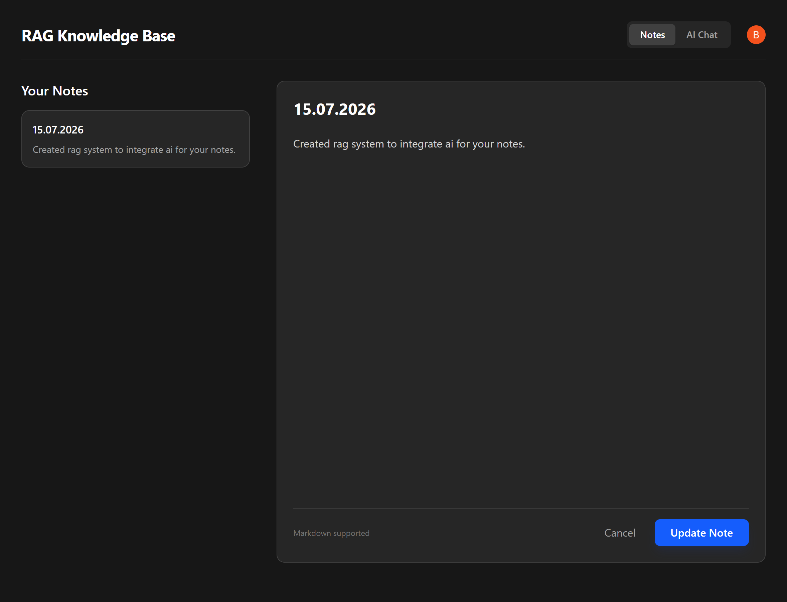
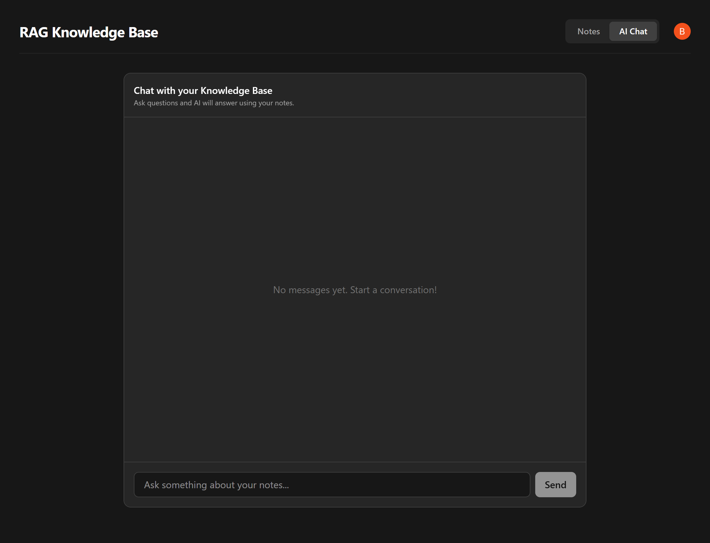

# RAG Knowledge Base 🧠

Welcome to your second brain! This is a full-stack application that lets you take markdown notes and instantly chat with them using an AI (LLM) powered by Retrieval-Augmented Generation (RAG).

## Screenshots

<div align="center">
  
  
</div>

## Tech Stack

- **Frontend**: React, Vite, TailwindCSS, Clerk (Authentication)
- **Backend**: FastAPI (Python), SQLAlchemy, Alembic
- **Database**: PostgreSQL with `pgvector` (via Neon)
- **AI/ML**: `sentence-transformers` (Local Embeddings), Groq (LLM Inference)

## Features

- **Markdown Notes**: Create, edit, and delete notes.
- **Auto-Vectorization**: Notes are automatically chunked and vectorized using `bge-small-en-v1.5` upon saving.
- **AI Chat**: Ask questions about your notes. The system performs a vector similarity search in PostgreSQL and feeds the relevant context to a Groq-powered LLM.
- **Secure**: Authentication is handled by Clerk, ensuring user data isolation.

## Running the App

You can run this application using Docker Compose or via a manual local setup.

### Option 1: Docker Compose

1. Install Docker and Docker Compose.
2. Fill out `.env` files in both `backend/` and `frontend/` directories (see `.env.example` in each).
3. Build and run:
   ```bash
   docker-compose up --build
   ```

### Option 2: Manual Setup

### 1. Prerequisites
- Node.js (v18+)
- Python (3.10+)
- A PostgreSQL database with the `pgvector` extension installed (e.g. Neon.tech).
- A Clerk Account for authentication keys.
- A Groq API Key for LLM inference.

### 2. Backend Setup
1. Open a terminal in the `backend` folder:
   ```bash
   cd backend
   ```
2. Create and activate a Python virtual environment:
   ```bash
   python -m venv venv
   # On Windows:
   venv\Scripts\activate
   # On Mac/Linux:
   source venv/bin/activate
   ```
3. Install dependencies:
   ```bash
   pip install -r requirements.txt
   ```
4. Environment Variables:
   Copy `.env.example` to `.env` and fill in your keys:
   ```bash
   cp .env.example .env
   ```
   *(Ensure you provide your Neon Database URL, Clerk Keys, and Groq API Key).*
5. Initialize the database and run migrations:
   ```bash
   python init_db.py
   alembic upgrade head
   ```
6. Start the FastAPI server:
   ```bash
   uvicorn main:app --reload
   ```

### 3. Frontend Setup
1. Open a new terminal in the `frontend` folder:
   ```bash
   cd frontend
   ```
2. Install dependencies:
   ```bash
   npm install
   ```
3. Environment Variables:
   Copy `.env.example` to `.env` and provide your Clerk Publishable Key:
   ```bash
   cp .env.example .env
   ```
4. Start the development server:
   ```bash
   npm run dev
   ```

## Running Tests
- **Backend**: In the `backend` directory, run `pytest`.
- **Frontend**: In the `frontend` directory, run `npm run test` or `npx vitest run`.
